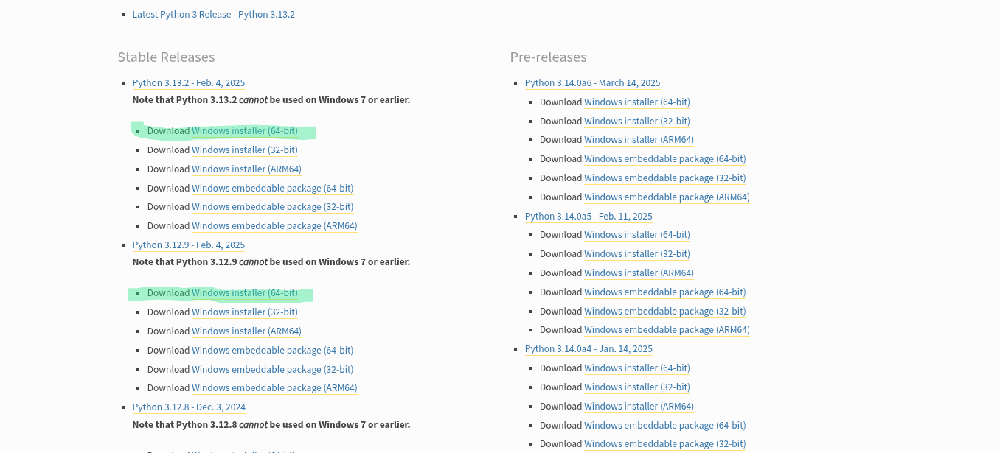

## 1. 環境設定

Pythonを用いたプログラミングを始めるために必要な前準備をします。  
数研の部室のPCだと設定が完了している場合が多いのでその場合は飛ばしても構いません。

### Pythonのインストール

1. [Pythonの公式サイト](https://www.python.org/downloads/windows/)にアクセスします。

2. パソコンの「設定」を開き、「システム」に移動して、「システムの種類」が64ビットか32ビットかを確認してください。

3. 64ビットの場合は次のページの緑色のところのどちらかをクリックしてダウンロードします。(必要に応じて他のバージョンのものをダウンロードしても構いません。)特に理由がなければ、上の新しいほうをダウンロードしましょう。

32ビットの場合はその一つ下のものをダウンロードします。

4. ダウンロードしたインストーラを起動し、下のAdd Python x.xx to PATHにチェックしてInstall Nowをクリックします。

5. 待てばダウンロードされます。デバイス変更の許可を問われたら許可してください。

### Visual Studio Codeのインストール

## 1.VSCodeのインストール
1. [VSCodeのダウンロードサイト](https://code.visualstudio.com/)から、VSCodeのインストーラーをダウンロードします。  

2. インストーラーを起動して、設定を進め、途中で「デスクトップ上にアイコンを作成する」と出てきたら、それにチェックを入れてインストールを完了させてください。  

3. 言語を日本語化しましょう。再生ボタンの下にある、四角が4つあるボタンを選んで検索欄に「japanese」とかを検索して、「Japanese Language Pack for Visual Studio Code」をインストールしましょう。  
あと、もう一つ。「Python」という拡張機能もインストールするのも忘れずに!  
これがないとPythonが動きません。
