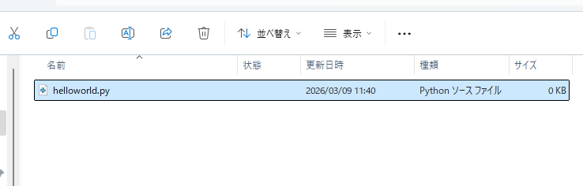
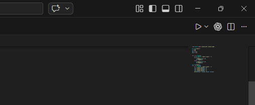
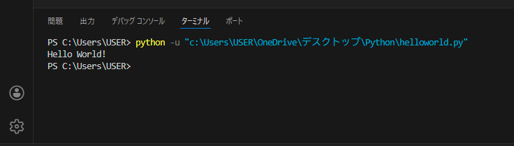

# プログラミングの時間だ！

環境構築お疲れさまでした。ここまでで一番つまらない時間は終わりました。さっそくプログラミングの世界に飛び込みましょう。

## 1.pythonファイルを作ろう
まずはコードを書き込むファイルを作りましょう。デスクトップに「Python」というフォルダを作ってください。(名前は別になんでもいいですがわかりやすいほうがいいです)  
フォルダを作ったらその中にhelloworld.pyというファイルを作ってください。Pythonコードのファイルであることをパソコン側は「.py」の部分で読み取っていますので、名前を変える場合は.pyの部分だけは変えないでください。  
できたら早速そのファイルをVisual Studio Code(以降vscodeと呼びます)で開きましょう。



## 2.プログラムにしゃべらせよう

プログラムに文字を出力させてみましょう。次のように打ち込んでみてください。
```python
print("Hello World!")
```

vscodeの画面の右上のほうに三角形のボタンがあると思います。それをクリックするとコードを実行することができます。


画面下になにやらいろいろ書かれているのが出てきたと思います。これは**ターミナル**といい、コードを実行したり、実行結果を出力したり、あとで使うinput関数で入力を受け取ったりするのに使います。



2行目に`Hello World!`と出てきているのがわかるでしょうか？これは「あなたが」書いたプログラムをPythonが読み取って実行した結果です。おめでとうございます！

### コードの解説

Pythonでは、`print(出力する内容)`で括弧の中の物を出力することができます。この`print`は**関数**というものなのですが、それはあとで扱います。

文字列を扱うには、`"`(ダブルクォーテーション)か`'`(シングルクオーテーション)を両端につけます。例えば、`"Suken"`、`'Hi'`のようにします。`"Hi'`のように片方ずつをつけることはできません。上の画像のように、基本的に文字列を出力すると端のクオーテーションは含まれませんが`"'a'"`のようにすると、`'a'`というシングルクオーテーションを含む文字列を作ることもできます。このように必要に応じて使い分けてください。

## 2-2.演習課題について

この講座には演習課題があります。基本的にできるごとが増えるごとに1~3問程度の問題が解けるようになります。  
演習課題には数研内部で運営している[サーバー](judge.suken.daemon.asia)を使用します。ここの使い方は部員に聞いてください。

> 今回の演習課題1: [Welcome To Suken!](https://judge.suken.daemon.asia/problem/edu001)
> 演習課題2: [Output Challenge](https://judge.suken.daemon.asia/problem/edu004)
