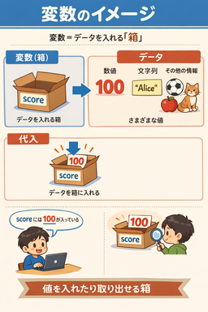

# 変数と関数

## 変数とは？

数学で学んだかScratchなどで変数を使ったことがある人はそのイメージで大丈夫です。しかし、数学とは少し違い、数字だけではなく文字列や後で説明するbool値なども保存することができます。

変数はデータを保存するための箱のようなもので、値を入れたり(代入するという)、何が入っているか確認したりできるものです。



pythonで変数を定義するには次のように書きます。以下は変数`x`に数値 $3$ を、変数`y`に文字列 `Hello` 代入する例です。Pythonで数値を扱う場合、クオーテーションを使う必要はありません。  
```python
x = 3
y = "Hello"

# ちゃんと代入されているか出力して確認
print(x)
print(y)
```
> [!TIP]
> #から始まる行がありますね。これは**コメント**といい、それより後ろに書いた同一行の部分はコードとして実行されません。ですから、コードの説明を書いたり、デバッグとして一時的にコードを無効化(**コメントアウト**という)したりするのに使います。

実行結果
```
3
Hello
```

## 関数とは
Scratchでいう赤色の「定義」ブロックと同じようなものです。数学の関数とは少し違います。  
プログラミングでいう関数は、**与えられた入力(引数)に対し、何らかの処理を施す**ものです。例えば、print関数だと与えられた引数に対し、「それを出力する」という処理を施しています。引数はないこともあり、その場合は毎回決まった処理をします。また、関数は関数を実行した結果である**戻り値**を返すことがあります。

ここでは、メジャーな関数の一つとして、前回に少しだけワードとして出た**input**関数を紹介します。  
input関数は、**標準入力**と呼ばれるユーザーがデータを入力するところ(これに対し、print関数などで出力するのは**標準出力**)から**一行**データを受け取りそれを文字列として返します。以下はユーザーの入力を受け取り、それを2回出力する例です。
```python
x = input() # 入力を受け取る

# 二回出力
print(x)
print(x)
```

input関数に文字列の引数を与えることもでき、その場合はその文字列が最初に出力され、その後ろにユーザーが答えを書く形式になります。ですから、クイズやユーザーへの質問などで問題文や質問文が必要な場合に使われます。以下はユーザーに「あなたの名前を教えてください:」と質問し、答えの文字列に敬称の「さん」を付けた文字列を出力する例です。二つの文字列を結合するには`+`を用います。(ここは次の項で詳しく扱います。)

```python
name = input("あなたの名前を教えてください:")
print(name + "さん")
```

## 演習課題

>> 今回の演習課題: [What's Your Student ID?](https://judge.suken.daemon.asia/problem/edu005)
